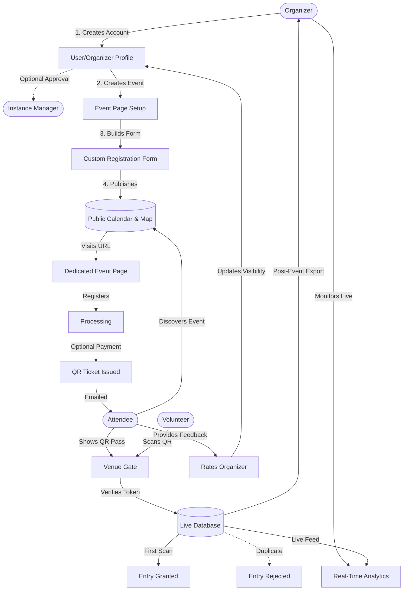

<div align="center">


# OPEN

**Free and Open Source Self Hostable Event Management Platform **

[](LICENSE)
[](https://go.dev/)
[](https://kit.svelte.dev/)
[](https://www.postgresql.org/)
[](https://www.docker.com/)


</div>

---

## The Problem

If you have ever organized an event, you would know that there are few comprehensive, open-source alternatives for event management and ticketing. Every popular platform is proprietary or centric to a specific organization, and an alarming number of them are privacy-hostile—a real concern for communities that champion data privacy. This leaves organizations and community leaders stuck choosing between building their own system from scratch at great expense, or surrendering attendee data to a third-party commercial platform. Even when a solution is cobbled together, everything ends up scattered: the registration form, event page, tickets, and feedback. The result is broken links, brand inconsistency, and a frustrating experience for everyone involved. Discovery is just as broken; if you are looking for local happenings in your college, city, or local area, you'll mostly find out about the events through scattered WhatsApp or Telegram groups—usually too late, and missing half the details. We have lived all of this firsthand, as organizers and attendees of community events in and around our college, and we built OpenPass to fix these problems with a single platform.

---

## The Solution

OpenPass is a fully free and open-source, self-hostable event platform that gives organizers everything they need in one place, without sacrificing attendee privacy or developer freedom. While OpenPass can be used for any type of event, communities wanting to keep a specific theme can self-host their own instance. Instance managers have full control to build curated communities by requiring proof of ID, specific event types, or affiliations before accepting organizers.

It works in two modes: list-only, where you publish your event so people can discover it on the OpenPass calendar and get directed to your existing registration or website; and full platform mode, where you run your entire event lifecycle inside OpenPass, covering registration, ticketing, check-in, and feedback.

### What's Included

| Feature | Description |
|---|---|
| **Location-Based Discovery** | Upcoming events and calendars are tailored to your IP location, with the ability to manually change regions right from the landing page. |
| **Map View & Trends** | Explore events via an interactive map, and discover trending topics and popular organizers in your area. |
| **User & Organizer Accounts** | Attendees can follow organizers to get notified of new events, manage tickets, and leave feedback/ratings. |
| **Custom Organizer Pages** | Organizers get a fully customizable event creation page and profile to build their audience. |
| **Instance Moderation** | Instance managers can curate their platform by vetting organizers and reviewing event proposals before they go live. |
| **Event Calendar** | A public, searchable index of upcoming events for community discovery |
| **Event QR Code** | Every event page has a unique QR code, and a home page scanner lets anyone jump straight to an event page instantly |
| **Event Details Page** | A dedicated, branded page for each event with all the information attendees need |
| **Custom Registration Forms** | Drag-and-drop form builder with text, select, checkbox, and more — unique per event |
| **Ticketing System** | Secure QR-code tickets delivered by email, with optional paid ticket support |
| **Check-in System** | Fast, offline-capable QR scanner for gate volunteers; prevents duplicates atomically |
| **Live Analytics** | Real-time dashboard showing registrations, check-ins, and capacity utilization |
| **Notifications & Exports** | Bulk email/SMS to attendees and one-click CSV export of all attendee data |

Everything is under one domain, one brand, one link.

---

## Workflow



---

## Tech Stack & Why We Chose It

### Backend — Go + Fiber + GORM

| Technology | Why |
|---|---|
| **Go 1.22** | Single static binary, trivially easy to self-host, excellent performance under concurrent load (door scans, registration spikes), and strong standard library for crypto/QR handling |
| **Fiber v2** | Express-inspired HTTP framework for Go — minimal boilerplate, zero-allocation routing, and built-in middleware for rate limiting and CORS |
| **GORM + pgx** | Idiomatic ORM for PostgreSQL with clean auto-migration support; pgx driver gives us the fastest Postgres connection pool available in Go |
| **golang-jwt/jwt** | Lightweight, spec-compliant JWT library for session tokens with cookie transport — no external auth service dependency |
| **Google UUID** | Cryptographically random UUIDs for all primary keys, ensuring attendee and event IDs are unpredictable |

### Frontend — SvelteKit + Tailwind CSS v4

| Technology | Why |
|---|---|
| **SvelteKit 2 / Svelte 5** | Compiler-based reactivity with near-zero JavaScript overhead; ships fast to low-end devices common at community venues |
| **Tailwind CSS v4** | Utility-first styling without a custom CSS build pipeline; v4's native CSS variables make theming trivial |
| **bits-ui** | Accessible, headless Svelte component primitives — we get full visual control without re-implementing ARIA from scratch |
| **@fontsource-variable/inter** | Self-hosted Inter font; no Google Fonts CDN calls, keeping the stack fully self-contained and privacy-respecting |
| **Lucide icons** | MIT-licensed, tree-shakeable icon set that integrates natively with Svelte |
| **TypeScript** | End-to-end type safety, catching API contract mismatches at compile time rather than in production |

### Infrastructure

| Technology | Why |
|---|---|
| **PostgreSQL 15** | Battle-tested relational database; JSONB columns give us schema-less flexibility for custom form data without sacrificing query power |
| **Docker Compose** | Single-command local development and production deployment; no Kubernetes required to self-host |

### Payments — Hyperswitch *(optional)*

We chose [Hyperswitch](https://hyperswitch.io/) as our payment orchestration layer because it is itself open-source, supports multiple payment processors through a single API, and aligns with our FOSS values. Payment support is completely optional — free events require no payment configuration at all.

---

## Getting Started

### Prerequisites

- [Docker](https://docs.docker.com/get-docker/) and Docker Compose
- Git

### Quickstart

```bash
# 1. Clone the repository
git clone https://github.com/eventiofoss/openpass.git
cd openpass

# 2. Configure environment variables
cp .env.example .env
# Edit .env and set your secrets (see Configuration below)

# 3. Start the full stack
docker compose up
```

The services will be available at:

| Service | URL |
|---|---|
| Frontend | http://localhost:5173 |
| API | http://localhost:8080 |
| API Health Check | http://localhost:8080/api/health |
| PostgreSQL | localhost:5432 |

### Configuration

Copy `.env.example` to `.env` and fill in the required values:

```env
# Database
POSTGRES_USER=postgres
POSTGRES_PASSWORD=your_secure_password
POSTGRES_DB=openpass

# API
JWT_SECRET=your_long_random_secret
PORT=8080

# (Optional) Payments — Hyperswitch
HYPERSWITCH_API_KEY=
HYPERSWITCH_PUBLISHABLE_KEY=
```

---

## Project Structure

```
openpass/
├── backend/                  # Go API server
│   ├── cmd/                  # Application entrypoint
│   ├── internal/
│   │   ├── api/              # HTTP handlers (events, registrations, check-in)
│   │   ├── database/         # GORM connection and migrations
│   │   ├── middleware/        # Auth, rate limiting
│   │   └── service/          # Business logic (forms, payments, QR, notifications)
│   ├── tests/                # Integration tests
│   └── API_DOCS.md           # Full API reference
│
├── frontend/                 # SvelteKit web app
│   └── src/
│       ├── lib/              # Shared components and utilities
│       └── routes/           # File-based pages and API routes
│
├── compose.yaml              # Docker Compose stack
├── schema.md                 # Database schema reference
└── modules.md                # Backend module development roadmap
```

---

## API Reference

The full REST API is documented in [`backend/API_DOCS.md`](backend/API_DOCS.md).

**Base URL:** `http://localhost:8080`

| Method | Path | Auth | Description |
|---|---|---|---|
| `GET` | `/api/health` | None | Health check |
| `POST` | `/api/auth/register` | None | Create organizer account |
| `POST` | `/api/auth/login` | None | Login and receive session cookie |
| `GET` | `/api/auth/me` | Cookie | Get current organizer |
| `POST` | `/api/auth/logout` | Cookie | Invalidate session |
| `POST` | `/api/events` | Cookie | Create event |
| `GET` | `/api/events` | Cookie | List owned events |
| `GET` | `/api/events/:id` | Cookie | Get event details |
| `PATCH` | `/api/events/:id` | Cookie | Update event |
| `DELETE` | `/api/events/:id` | Cookie | Delete event |
| `POST` | `/api/events/:id/forms` | Cookie | Set registration form fields |
| `GET` | `/api/events/:id/forms` | None | Get public form schema |
| `POST` | `/api/events/:id/register` | None | Attendee registration |
| `POST` | `/api/checkins/scan` | Cookie | QR scan and check-in |
| `GET` | `/api/events/:id/analytics` | Cookie | Live analytics |
| `GET` | `/api/events/:id/export` | Cookie | CSV attendee export |

---

## Roadmap


- [ ] Feedback forms — post-event surveys linked to attendee records
- [ ] Federation / event discovery network — instances can share public event listings
- [ ] Mobile-first volunteer scanner PWA — offline-capable, works on cheap Android handsets
- [ ] Waitlist management — automatic promotion when a spot opens
- [ ] Multi-language support (Tamil, Hindi, …)
- [ ] Email templates — customizable HTML email pass designs per event
- [ ] Webhook integrations — push registration events to Telegram bots, Discord, etc.
- [ ] Fine-grained RBAC — separate permissions for admins, volunteers, and co-organizers

---

## Contributing

OpenPass is community-built and welcomes contributions of all kinds — code, documentation, translation, design, and testing.

```bash
# Development (with hot reload)
docker compose up

# Run backend tests
cd backend && go test ./...

# Run frontend type check
cd frontend && npm run check
```

---

## Design

https://www.figma.com/design/tIgnL0hyvE9FXkURPjet1n/OPEN-PASS

---

## License

OpenPass is released under the [GNU Affero General Public License v3.0](LICENSE) (AGPL-3.0).

This means:
- You can use, modify, and self-host OpenPass freely.
- If you run a modified version as a public service, you must publish your source changes under the same license.
- This keeps the ecosystem open and ensures improvements benefit everyone.

---

## Acknowledgements

Built with ❤️ by the FOSS community, for every community.

Inspired by every organizer who has ever juggled five different platforms to run a single event, every attendee who found out about a meetup *after* it happened, and every enthusiast who ever had to hand their attendee list to a proprietary service because there was no alternative.

---

<div align="center">

**OpenPass** · [Report a Bug](https://github.com/eventiofoss/openpass/issues) · [Request a Feature](https://github.com/eventiofoss/openpass/issues)

</div>
